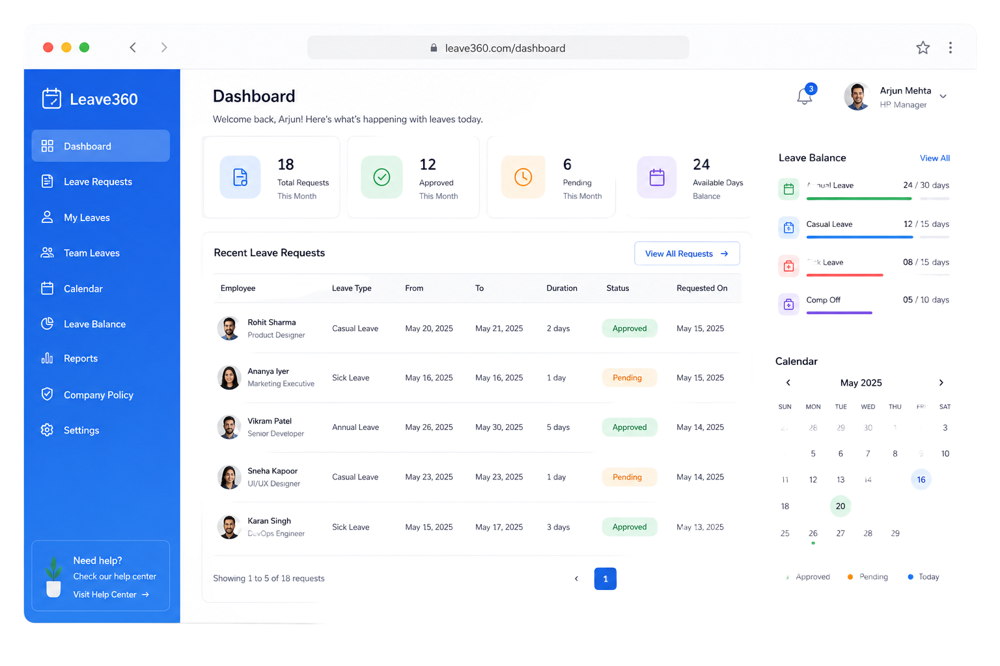
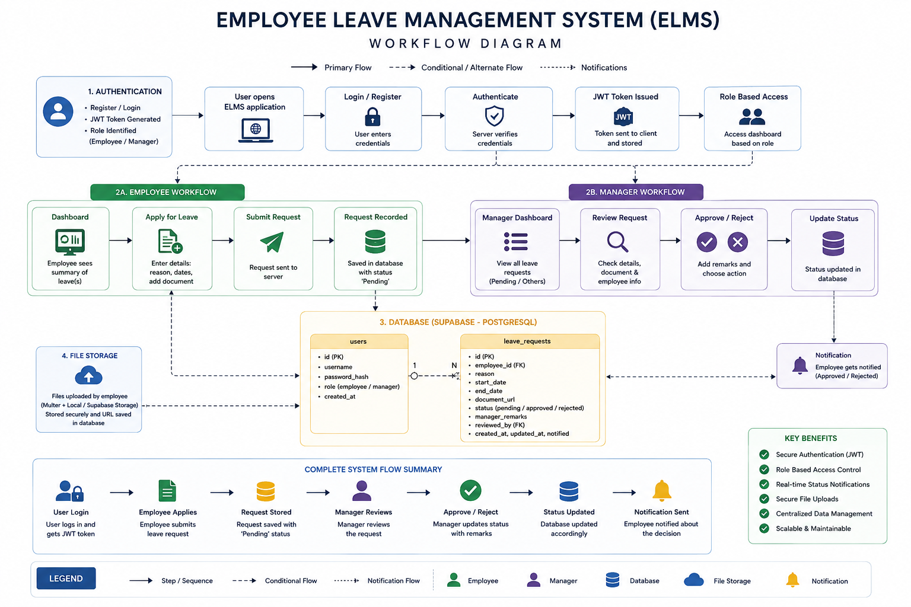
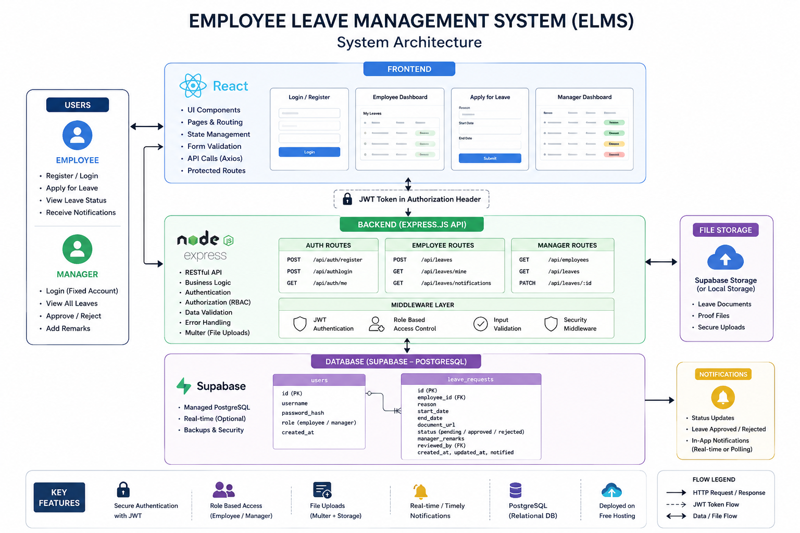
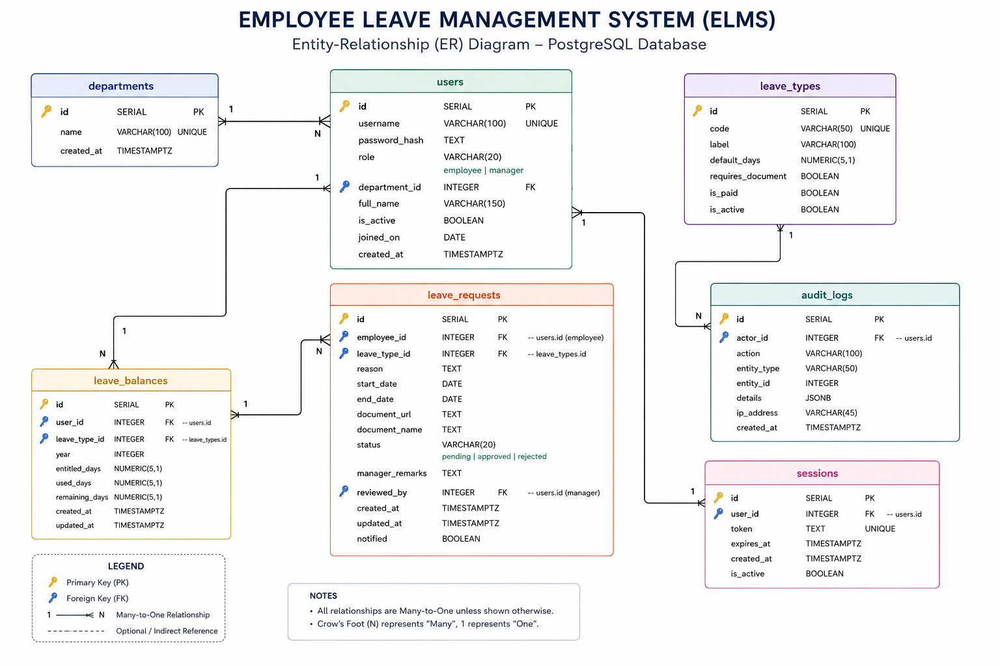

# ELMS — Employee Leave Management System



A comprehensive, production-ready web application for managing employee leave requests. ELMS streamlines the process for employees to apply for time off and for managers to review, approve, or reject these requests with full accountability and transparency.

## 📑 Table of Contents

- [🚀 Live Links](#-live-links)
- [📖 About The Project](#-about-the-project)
  - [Key Features](#key-features)
- [💻 Tech Stack](#-tech-stack)
- [⚙️ Local Setup Instructions](#️-local-setup-instructions)
- [🔐 Demo Credentials](#-demo-credentials)
- [🏗️ Architecture & Security](#️-architecture--security)

---

## 🚀 Live Links

- **Live Application:** [https://elms-zollid.vercel.app/](https://elms-zollid.vercel.app/)
- **Figma Design:** [View Design File](https://www.figma.com/design/3vu2uwmhYoH0eSFxP3b1EP/elms?node-id=0-1&t=L8DtpLKx2qYovIHJ-1)
- **Backend API :**	[BACKEND SERVER](https://worktime-manager-1.onrender.com)

---

## 📖 About The Project



ELMS provides a complete workflow for leave management:
- **Employees** can register, apply for leave, upload supporting documents (e.g., medical certificates), and track the status of their requests.
- **Managers** have a dedicated portal to view all pending requests across the organization, review attached documents, and make decisions with mandatory remarks.

The focus of this project is on building a functional application with clean code, secure role-based access control, and an exceptional user experience with dynamic notifications.

### Key Features
- **Role-Based Access Control (RBAC):** Distinct portals for Employees and Managers.
- **Secure Authentication:** JWT-based stateless authentication with password hashing.
- **Leave Application & Document Upload:** Submit requests with dates, reasons, and file attachments.
- **Real-time Notifications:** In-app toast notifications to alert employees when a request's status changes.
- **Manager Dashboard:** Comprehensive view for managers to evaluate requests efficiently.

---

## 💻 Tech Stack

| Layer | Choice |
|---|---|
| Frontend | React 18 + Vite, React Router, Tailwind CSS |
| Backend | Node.js + Express 4 |
| Database | PostgreSQL (Supabase) |
| Auth | JWT access token + bcrypt |
| Uploads | Multer, disk storage |
| Validation | Zod |

---

## ⚙️ Local Setup Instructions

> Using your own Supabase project? Follow **[SUPABASE_SETUP.md](./SUPABASE_SETUP.md)**
> for the connection string, env values, migration and troubleshooting.

### 1. Clone the repository
```bash
git clone <repo>
cd elms
```

### 2. Backend Setup
```bash
cd server
cp .env.example .env      # Fill in DATABASE_URL, JWT_SECRET, MANAGER_SEED_PASSWORD
npm install

# Setup Database & Seed Data
npm run db:check          # Verifies DATABASE_URL reaches your Postgres
npm run schema            # Applies schema.sql
npm run seed              # Creates the single manager (+ optional demo employee)

# Run the API server
npm run dev               # Starts on http://localhost:4000
```

### 3. Frontend Setup
```bash
cd ../client
cp .env.example .env      # Set VITE_API_URL=http://localhost:4000/api
npm install
npm run dev               # Starts on http://localhost:5173
```

---

## 🔐 Demo Credentials

These credentials can be used to log in and test the live application:

| Role | Username | Password |
|---|---|---|
| Manager | `manager@gcu.in` | `manager@2706` |
| Employee | `employee@gcu.in` | `employee@2706` |

*Note: There is no way to create a manager through the UI or the API for security reasons. Managers can only be seeded by administrators.*

---

## 🏗️ Architecture & Security

### System Architecture


### Database Schema


**Every rule is enforced on the backend.** The React app is a convenience layer; assume it can be bypassed with `curl` and the API still holds.

- **Passwords:** bcrypt-hashed, cost ≥ 12.
- **Ownership:** Enforced in SQL (`WHERE employee_id = $1`), never by filtering a fetch-all in JS.
- **Uploads:** MIME-whitelisted (PDF/PNG/JPEG), size-capped, and served securely behind auth + ownership checks.
- **CORS & Rate Limiting:** Enforced on API endpoints to prevent abuse.
- **Data Integrity:** Database-level constraints ensure no overlapping leave dates and maintain rigorous state control.

See [ARCHITECTURE.md](./elms/ARCHITECTURE.md) for a full request lifecycle trace
